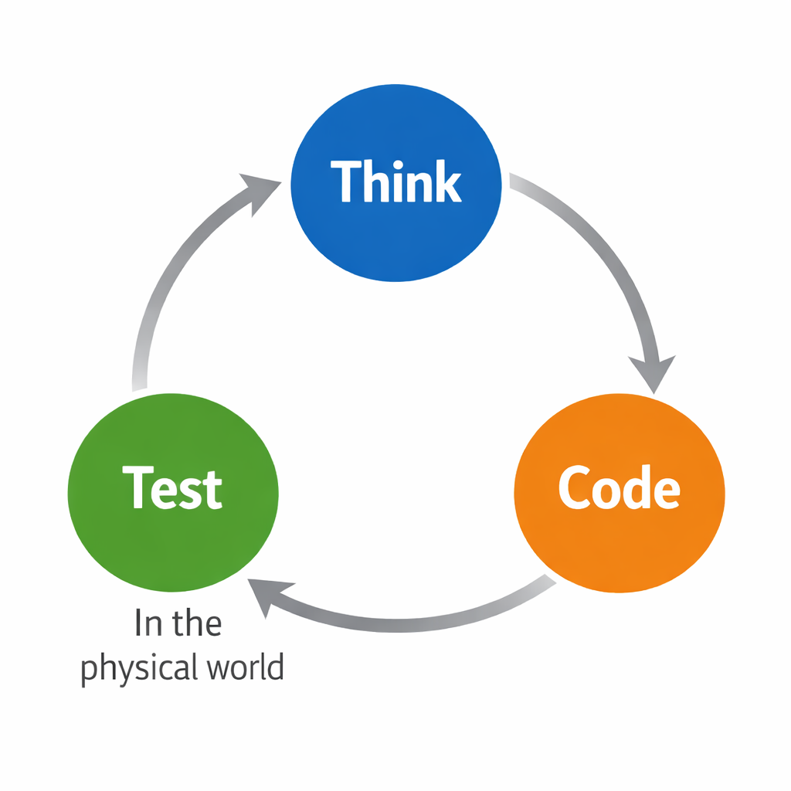

# Cursor Experiments for Embedded Development

Embedded development, at least for hardware engineers, usually follows a simple loop: **Think → Code → Test**.

In practice, this means making assumptions, writing code, testing on real hardware, observing the physical output, and repeating the cycle.

I’ve been using GitHub Copilot to assist with the **Think** and **Code** parts of this loop. The **Test** stage, however, still depends heavily on physical-world work: measuring voltage, capturing waveforms, watching LEDs, soldering wires, and more. These steps require human involvement, which makes the loop difficult to fully automate and inherently slow.

This repository documents my experiments in reducing that manual effort and automating as much of the loop as possible.

I am **not** trying to automate physical tasks such as soldering or desoldering. Instead, I’m exploring ways to automate testing and interaction with hardware by using:

- logic analyzers to read signal levels and decode protocols,
- analog switch matrices to remap connections,
- possibly USB analyzers,
- and custom hardware that removes the need to physically press buttons or toggle switches for power cycling or bootloader entry.

The goal is to see how far this workflow can be pushed toward automation, even when real hardware remains part of the loop.

