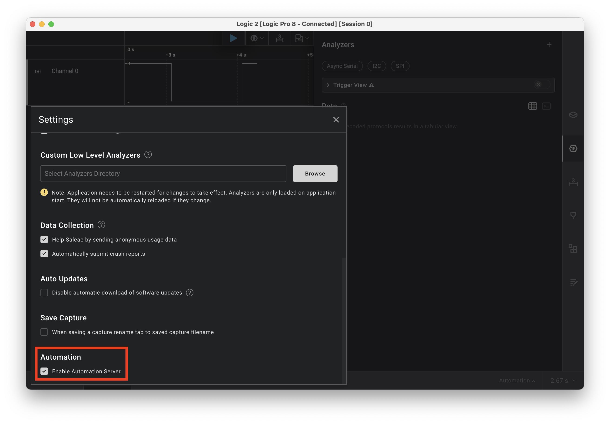

# Basic blink LED

## Just make a blink LED with Arduino Uno

Making a blinking LED is most basic Hello World code for electronics. You just download Arduino IDE, open the example, choose the correct board and port, press upload and you are done. 

I guess the agent prefer Arduino Cli, so let's get started!

I typed the following in the chat window of cursor.

```
Can you help me install Arduino cli in a folder called "arduino_cli", inside the exp1_LED_blink_on_Arduino_uno. Ideally, I want you to write a shell script inside exp1_LED_blink_on_Arduino_uno, it will download pre-compiled macOS ARM binary and unzip it there. You can test if it works. And ultimately, I will be able to run the script anywhere to get the Arduino CLI ready.
You can keep try the script you made until you've verified it works.
I found the Binary on https://arduino.github.io/arduino-cli/1.4/installation/ 
```

And I got install_arduino_cli.sh, and the "arduino_cli" folder pops up!

Then I typed:

```
That is nice, I can confirn the Arduino Cli is ready. Do I need to install anything to compile and upload Arduino Uno? If so I also want it to stay inside the "arduino_cli" folder
```

And I got another setup_arduino_uno.sh

Now let‘s create a blink code.

```
Great! now please create a blinking LED code on pin13 for Arduino, inside the exp1_LED_blink_on_Arduino_uno, and another shell script to compile and upload through serial
```

And the "blink_pin13" shows up and the "compile_and_upload.sh" script can compile and upload the code, I can see the LED blink!

But wait, my goal was to remove myself from the loop. maybe I can use a logic analyzer to check the signal instead of me look into it.

I have Saleae Logic Analyzer and it supports API access, so it should be able to automate the measurement. The Saleae Logic support "logic2-automation" library and it can be installed with ```python3 -m pip install logic2-automation```.

And inside Logic2 software, we need to enable "Automation Server", and configure the channel correctly.


