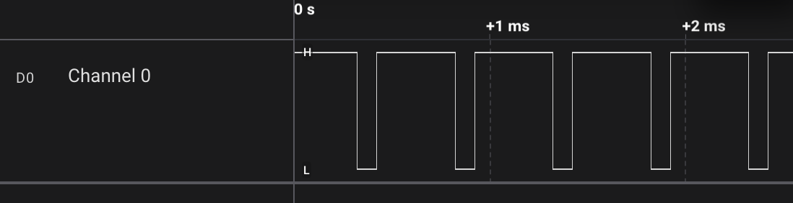

# Let agent write PWM from registers

This is a easy practice for agent. I want to check how good agent is to refer to existing scripts and create new ones.

The goal is to output 2Khz PWM on PB3 with register access. Here is what I typed:

```
OK, now I want a 80% high 20% low 2Khz PWM on PB3, please create an Arduino sketch in exp2_PWM_register_Arduino_uno and use registers access to set up the peripheral properly. 
There is a datasheet in exp2_PWM_register_Arduino_uno, 
And you can refer to compile_and_upload.sh and saleae_measure_blink.py in exp1_LED_blink_on_Arduino_uno to compile and test hardware output with saleae. Iterate by yourself until you get the registers working, and the signal should be measured correctly. Run the code to verify funtion before stop.
```

And the Cursor agent get it right in the first try! 



```
% python3 saleae_measure_pwm_pb3.py   
Connected to Logic2 app_version=2.4.43 api=Version(major=1, minor=0, patch=0)
period: n=4133 mean=0.000499338s stdev=0.000000552s min=0.000493500s max=0.000505000s
high  : n=4133 mean=0.000399723s stdev=0.000000553s min=0.000394000s max=0.000405500s
low   : n=4134 mean=0.000099614s stdev=0.000000543s min=0.000094000s max=0.000105500s
Derived: f=2002.653 Hz duty=80.05%
PASS: PWM timing within tolerance
```

code:

```
#include <avr/io.h>

static constexpr uint8_t DUTY_OCR2A = 204;  // ~80% of 255 (80% duty)

void setup() {
  // PB3 (D11) as output.
  DDRB |= (1 << DDB3);

  // Stop timer while configuring.
  TCCR2A = 0;
  TCCR2B = 0;
  TCNT2 = 0;

  // Fast PWM, TOP=0xFF: WGM22:0 = 0b011
  // - WGM21=1, WGM20=1 (in TCCR2A)
  // - WGM22=0 (in TCCR2B)
  TCCR2A |= (1 << WGM21) | (1 << WGM20);

  // Clear OC2A on compare match, set at BOTTOM (non-inverting PWM on OC2A).
  TCCR2A |= (1 << COM2A1);

  // Duty cycle.
  OCR2A = DUTY_OCR2A;

  // Prescaler = 32: CS22:0 = 0b011 (Timer2 only)
  TCCR2B |= (1 << CS21) | (1 << CS20);
}

void loop() {
  // Hardware PWM runs continuously.
}
```