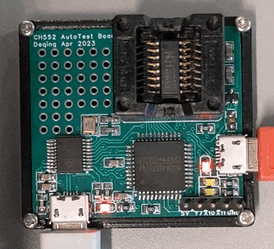

# Do coding and automatic testing on a less-documented MCU

In the past I have a test jig for Nanjing Qinheng Microelectronics (WCH) [CH552](https://www.wch.cn/products/CH552.html) chip. I have an [Arduino package](https://github.com/DeqingSun/ch55xduino) and it can compile and flash CH552 chip on multiple OS.


This test Jig has a CH552 mounted on a test socket for easy replacement. And CH552's GPIOs is tied to a CH446 matrix analog switch chip. So the CH552's GPIOs can be mapped to controller's GPIO, LED or pin headers. So the controller (CH559) will be able to test all GPIOs on CH552.

First ask this to add some comment:

```
Now I'm working in exp3_LED_blink_on_CH552_on_CH559_jig. Please read the ch559_jig_code.py, and add instrucion as comment in that file to talk about how to use the library. And what each function do. You can refer to run_arduino_test.py, README.md, and https://github.com/DeqingSun/CH552-Automatic-Test-Jig . The source code on the other side of CH559 is CH559_firmware.
```

Now we start the challenge.

We generate script to install Arduino.

```
in exp3_LED_blink_on_CH552_on_CH559_jig, first create a shell script to install Arduino cli, and add ch55xduino package, refer to scripts in exp1_LED_blink_on_Arduino_uno
Test the script before you end
```

Then:

```
Write an Arduino Sketch to blink P3.3 on CH552, do not use any Arduino library and use register access directly. Blink 1s On and 1s Off. Using timer1 or timer2 to make sure timing is accurate. When you finish such sketch, compile and test it on the jig. You should make a python script to kick CH552 into bootloader, upload the code, and then, test to see if high low timing is accurate (2%). Make sure test passes.
Hint, when you connect the P3.3 of CH552 to a CH559 pin, also connect that CH559 pin to PIN_EXT_LED_10_X, so I can help to tell you if it blinks.
```

After a few minutes I get the script! And it shows:

```
% python3 run_ch552_p33_timer2_blink_jig.py 
Compiling…
  hex: /Users/deqinguser/Documents/GitHub/Cursor-experiment-for-embedded-development/exp3_LED_blink_on_CH552_on_CH559_jig/ch552_p33_timer2_blink/build_ci/ch552_p33_timer2_blink.ino.hex
Using uploader: /Users/deqinguser/Library/Arduino15/packages/CH55xDuino/tools/MCS51Tools/2023.10.10/macosx/vnproch55x
Uploading…
Measuring P3.3 timing on CH559 pin 25 (±2 %)…
  high: median=1.0139s (n=12) OK
  low: median=1.0135s (n=12) OK
PASS: timing within ±2 %.
```

And visually, the LED blinks!


