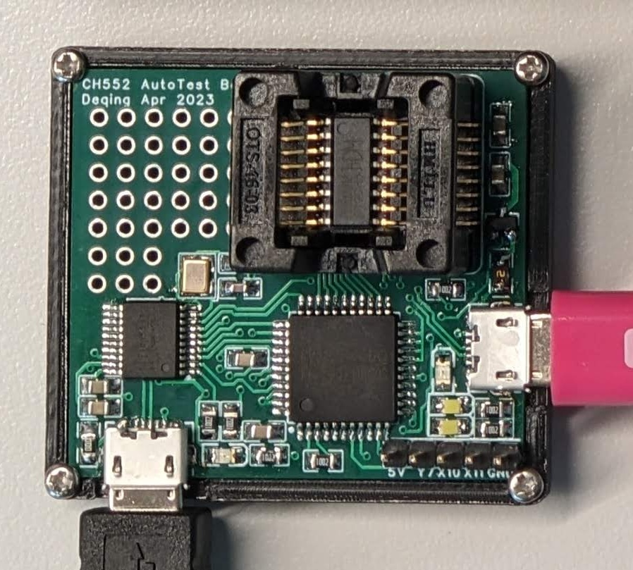

# Do coding and automatic testing on a less-documented MCU

In the past I have a test jig for Nanjing Qinheng Microelectronics (WCH) [CH552](https://www.wch.cn/products/CH552.html) chip. I have an [Arduino package](https://github.com/DeqingSun/ch55xduino) and it can compile and flash CH552 chip on multiple OS.



This test Jig has a CH552 mounted on a test socket for easy replacement. And CH552's GPIOs is tied to a CH446 matrix analog switch chip. So the CH552's GPIOs can be mapped to controller's GPIO, LED or pin headers. So the controller (CH559) will be able to test all GPIOs on CH552.

First ask this to add some comment:

```
Now I'm working in exp3_LED_blink_on_CH552_on_CH559_jig. Please read the ch559_jig_code.py, and add instrucion as comment in that file to talk about how to use the library. And what each function do. You can refer to run_arduino_test.py, README.md, and https://github.com/DeqingSun/CH552-Automatic-Test-Jig . The source code on the other side of CH559 is CH559_firmware.
```

