# CH572 Bootloader Execution Flowchart

Load address: `0x3C000` | Size: 8 KB | Architecture: RV32IMC

```mermaid
flowchart TD
    POWERON([Power-On / Reset]) --> START

    START["_start @ 0x3C000
    j _startup"]

    START --> STARTUP

    STARTUP["_startup @ 0x3C004
    ① Copy .data from flash→RAM
       src: 0x3C400, dst: 0x20001B38, len ~0x400
    ② Zero .bss in RAM
    ③ Set MTVEC = (isr_table_base | 3)
       vectored mode, table @ RAM 0x2003C0F8
    ④ Set MSP / stack pointer
    ⑤ MEPC = main, MSTATUS.MPP=11
    ⑥ MRET → jumps to main"]

    STARTUP --> HWINIT

    HWINIT["hw_init @ 0x3C140
    ① Safe-access: write 0x57,0xA8 → R8_SAFE_ACCESS_SIG
    ② R8_HFCK_PWR_CTRL |= RB_CLK_PLL_PON  (enable PLL)
    ③ Delay loop ~10 µs
    ④ R8_CLK_SYS_CFG = 0x59
       bits[7:6]=01→PLL src, bits[4:0]=25→÷25
       Fsys = 600 MHz ÷ 25 = 24 MHz
    ⑤ R8_FLASH_SCK = 0x03  (flash SPI ÷4 = 6 MHz)
    ⑥ R8_FLASH_CFG = 0x52  (read mode, latency)"]

    HWINIT --> BOOTINFO

    BOOTINFO["Read BOOT INFO
    FLASH_EEPROM_CMD(CMD_GET_ROM_INFO,
        ROM_CFG_BOOT_INFO=0x3DFF8, buf, 0)
    → 8 bytes into RAM 0x20001B38
    Contains: boot flags, version, reserved"]

    BOOTINFO --> MACREAD

    MACREAD["Read MAC Address
    FLASH_EEPROM_CMD(CMD_GET_ROM_INFO,
        ROM_CFG_MAC_ADDR=0x3F018, buf, 0)
    → 6 bytes into RAM 0x20001BB0"]

    MACREAD --> USBDETECT

    USBDETECT["USB Presence Detection
    is_usb_connected @ 0x3C1C0
    Read R32_PA_PIN (0x400010A4)
    Check D+ (PA3) and D- (PA2) pin states
    Loop up to 100 iterations ~1 ms"]

    USBDETECT --> USBPRESENT{USB detected?\nD+/D- not both low}

    USBPRESENT -- YES --> USBINIT
    USBPRESENT -- NO --> UARTINIT

    %% ─── USB PATH ───────────────────────────────────────────
    USBINIT["usb_init @ 0x3D102
    ① R8_USB_CTRL = RB_UC_DEV_PU_EN | RB_UC_INT_BUSY | RB_UC_DMA_EN
    ② Set EP0 IN/OUT buffer pointers (RAM 0x20001E80)
    ③ Set EP2 IN buffer (RAM 0x20001EC0, bulk IN)
    ④ Set EP3 OUT buffer (RAM 0x20001F00, bulk OUT)
    ⑤ R8_USB_DEV_AD = 0x00  (address 0)
    ⑥ R8_UEP0_CTRL = UEP_R_RES_ACK | UEP_T_RES_NAK
    ⑦ Enable USB interrupt via PFIC
       PFIC base 0xE000E000, IRQ 27"]

    USBINIT --> USBLOOP

    USBLOOP(["USB Event Loop (main loop)"])

    USBLOOP --> USBWAIT["Wait for USB interrupt
    wfi  (wait-for-interrupt)"]

    USBWAIT --> USBISR

    USBISR["usb_isr @ 0x3CD5A
    Read R8_USB_INT_FG
    Read R8_USB_INT_ST"]

    USBISR --> USBINTTYPE{Interrupt type?}

    USBINTTYPE -- "RB_UIF_TRANSFER\n(EP transfer done)" --> EPCHECK{Endpoint?}
    USBINTTYPE -- "RB_UIF_BUS_RST\n(bus reset)" --> BUSRESET["Reset USB state
    address=0, ep0 state=IDLE"]
    USBINTTYPE -- "RB_UIF_SUSPEND\n(suspend)" --> SUSPEND["Set suspend flag"]

    BUSRESET --> USBLOOP
    SUSPEND --> USBLOOP

    EPCHECK -- "EP0 SETUP" --> EP0SETUP["Parse SETUP packet
    bmRequestType, bRequest, wValue,
    wIndex, wLength from EP0 buffer
    Handle: SET_ADDRESS, GET_DESCRIPTOR,
    SET_CONFIGURATION, vendor cmds"]

    EPCHECK -- "EP0 IN" --> EP0IN["Send next descriptor chunk
    or ZLP if done"]

    EPCHECK -- "EP2 IN (bulk IN)" --> EP2IN["Bulk IN complete
    Mark TX buffer free
    Advance ISP response state"]

    EPCHECK -- "EP3 OUT (bulk OUT)" --> EP3OUT["Bulk OUT data received
    Copy to ISP recv buffer
    Call isp_process_packet if complete"]

    EP0SETUP --> USBLOOP
    EP0IN --> USBLOOP
    EP2IN --> USBLOOP
    EP3OUT --> ISPPROCESS

    %% ─── UART PATH ──────────────────────────────────────────
    UARTINIT["uart_init @ 0x3D190
    ① R16_UART_DL = 26  (24MHz÷16÷26 ≈ 57692 baud ≈ 57600)
    ② R8_UART_LCR = 0x03  (8N1, DLAB=0)
    ③ R8_UART_FCR = 0x07  (FIFO enable, RX/TX reset)
    ④ R8_UART_IER = 0x01  (RX data available interrupt)
    ⑤ Enable UART interrupt via PFIC"]

    UARTINIT --> UARTLOOP

    UARTLOOP(["UART ISP Task Loop"])
    UARTLOOP --> UARTWAIT["uart_isp_task @ 0x3CB72
    Poll R8_UART_LSR for RX data ready"]

    UARTWAIT --> UARTRX{RX byte available?}
    UARTRX -- NO --> UARTLOOP
    UARTRX -- YES --> RXBYTE["Read byte from R8_UART_RBR
    uart_read_byte @ 0x3C1EA"]

    RXBYTE --> SYNCCHECK{Sync byte?\n0x57}
    SYNCCHECK -- NO --> UARTRX
    SYNCCHECK -- YES --> PKTHEADER["Receive packet header:
    cmd(1) + tag(1) + len(2) = 4 bytes"]

    PKTHEADER --> PKTDATA["Receive payload bytes
    Loop uart_read_byte × len"]

    PKTDATA --> ISPPROCESS

    %% ─── ISP PACKET PROCESSING ──────────────────────────────
    ISPPROCESS["isp_process_packet @ 0x3C218
    Decode command byte"]

    ISPPROCESS --> CMDSWITCH{Command?}

    CMDSWITCH -- "0xA1\nISP_KEY_CMD" --> CMDA1["A1: Key Exchange
    Receive host key bytes
    XOR with chip ID / unique ID
    Store session key in RAM
    Send ACK + chip info response"]

    CMDSWITCH -- "0xA2\nISP_ERASE" --> CMDA2["A2: Erase Flash
    Parse target address + length
    Align to 4 KB block boundary
    FLASH_EEPROM_CMD(CMD_FLASH_ROM_ERASE,
        addr, NULL, len)
    Send ACK/NACK"]

    CMDSWITCH -- "0xA3\nISP_PROGRAM" --> CMDA3["A3: Program Flash
    Copy payload to flash_buf
    FLASH_EEPROM_CMD(CMD_FLASH_ROM_WRITE,
        flash_target_addr, buf, len)
    Advance flash_target_addr += len
    Send ACK/NACK"]

    CMDSWITCH -- "0xA4\nISP_VERIFY" --> CMDA4["A4: Verify Flash
    FLASH_EEPROM_CMD(CMD_FLASH_ROM_VERIFY,
        flash_target_addr, buf, len)
    Compare read-back vs payload
    Set verify_mode flag
    Send ACK/NACK + mismatch count"]

    CMDSWITCH -- "0xA5\nISP_READ_CFG" --> CMDA5["A5: Read Config
    Read chip config / option bytes
    from INFO area (0x3E000)
    Copy to response buffer
    Send ACK + config bytes"]

    CMDSWITCH -- "0xA7\nISP_SET_ADDR" --> CMDA7["A7: Set Flash Address
    Extract 32-bit target address
    Store in flash_target_addr
    Reset bytes_received counter
    Send ACK"]

    CMDSWITCH -- "0xA8\nISP_END" --> CMDA8["A8: End / Boot
    Send final ACK response
    Set boot_cont = 1"]

    CMDSWITCH -- "0xC5\nISP_RESET" --> CMDC5["C5: Reset
    Optionally: reboot chip
    or re-enter bootloader"]

    CMDA1 --> SENDRESP
    CMDA2 --> SENDRESP
    CMDA3 --> SENDRESP
    CMDA4 --> SENDRESP
    CMDA5 --> SENDRESP
    CMDA7 --> SENDRESP
    CMDA8 --> BOOTCHECK
    CMDC5 --> SENDRESP

    SENDRESP["Send response packet
    0x02 + tag + len(2) + status(1) + payload"]

    SENDRESP --> USBLOOP
    SENDRESP --> UARTLOOP

    %% ─── BOOT DECISION ──────────────────────────────────────
    BOOTCHECK{boot_cont == 1?}

    BOOTCHECK -- NO --> USBLOOP
    BOOTCHECK -- NO --> UARTLOOP
    BOOTCHECK -- YES --> JUMPUSER

    JUMPUSER["Jump to User Code
    ① Disable USB / UART peripherals
    ② Restore default clock (optional)
    ③ csrw MEPC, x0   (target: 0x00000000)
    ④ Set MSTATUS.MPP = 00 (user mode) or 11
    ⑤ MRET → CPU fetches from 0x00000000
       (user application reset vector)"]

    JUMPUSER --> USERCODE([User Application Runs])
```

## Notes on the Flow

### USB vs UART Selection
The bootloader checks for USB presence (D+ high) by polling `R32_PA_PIN` up to 100 times. If a host pull-up is detected on D+, it initializes USB; otherwise, it falls back to UART at 57600 baud.

### ISP Protocol Framing
- **UART frame**: `0x57` (sync) + `cmd` + `tag` + `len_lo` + `len_hi` + payload
- **USB frame**: bulk transfer, same payload structure without the 0x57 sync byte
- Response: `0x02` + `tag` + `len_lo` + `len_hi` + `status` + payload

### Flash Operations
All flash operations go through `FLASH_EEPROM_CMD` at ROM address `0x3D7F8`, which is a ROM-resident function (not in the bootloader image itself). The bootloader calls it with one of: `CMD_FLASH_ROM_ERASE` (0x01), `CMD_FLASH_ROM_WRITE` (0x02), `CMD_FLASH_ROM_VERIFY` (0x03).

### Jump to User Code
After receiving ISP_END (0xA8), `boot_cont` is set and the main loop exits. The bootloader sets `MEPC = 0x00000000` and executes `MRET`, which causes the CPU to branch to the user application reset vector at flash address 0.

### Security
The A1 key exchange establishes an XOR cipher session key used to obfuscate subsequent data payloads. The key is derived from the 64-bit chip unique ID and a host-provided nonce.
